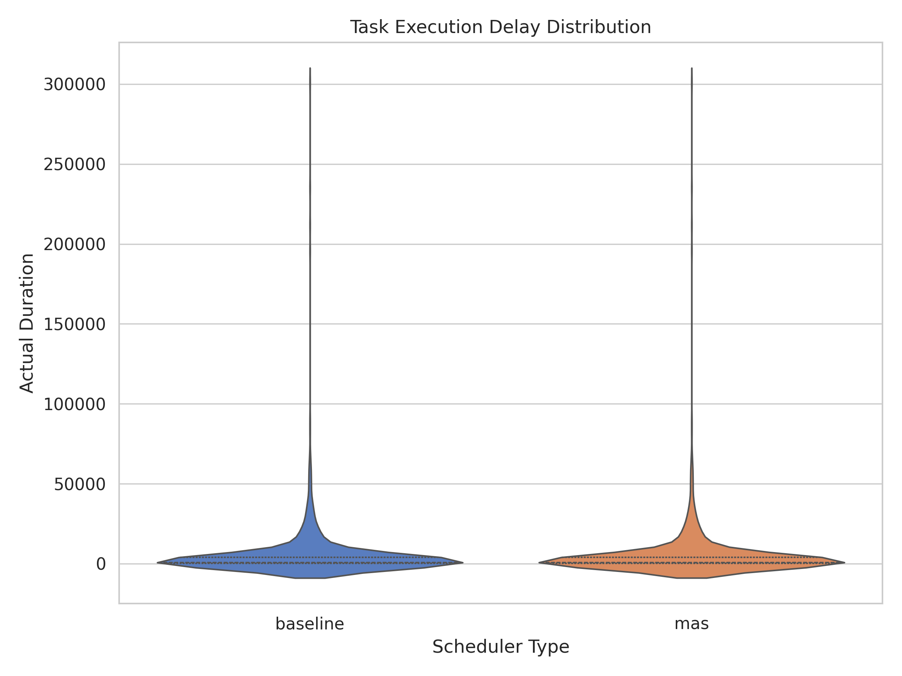
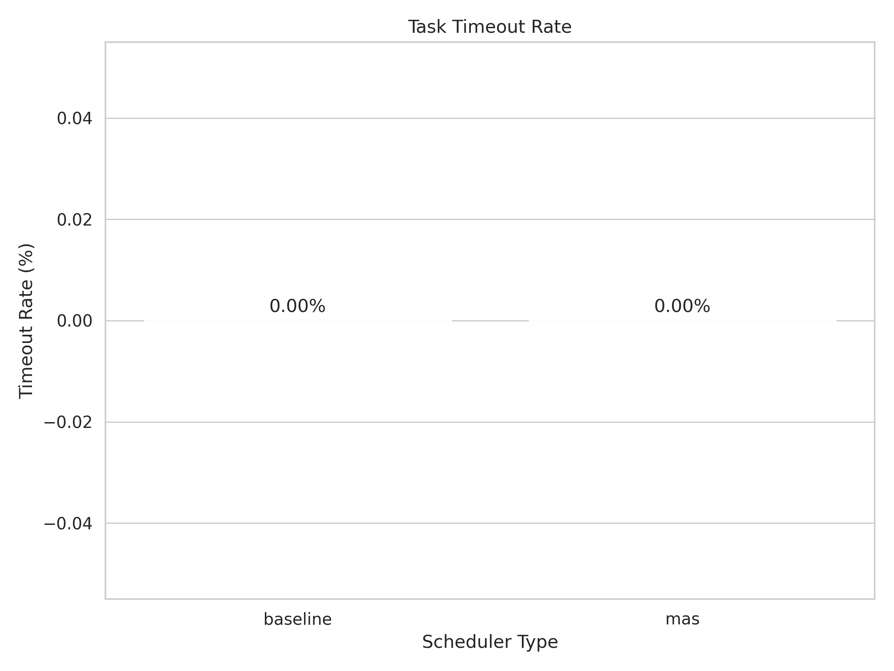
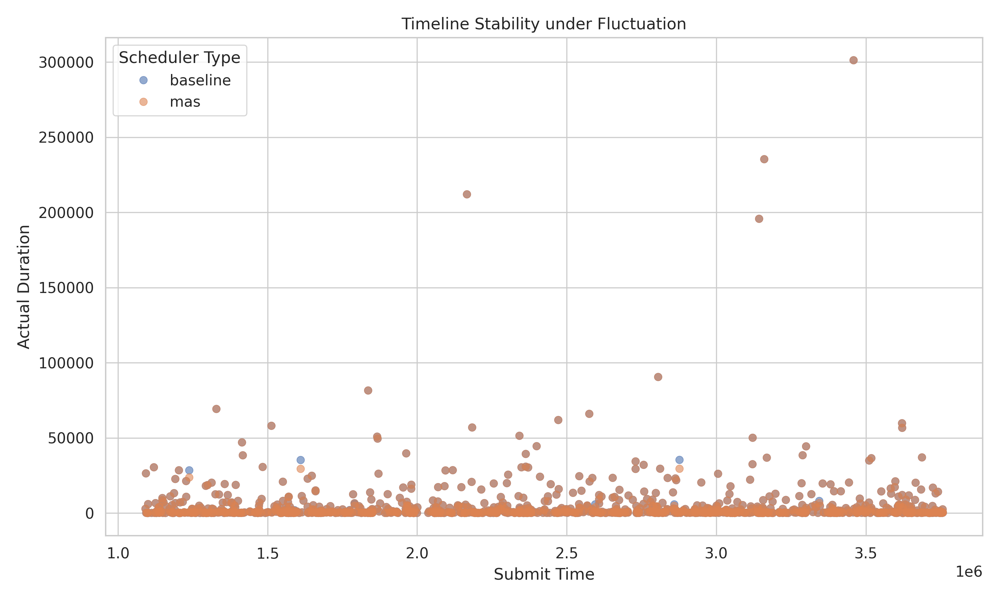

# Multi-Agent Scheduling Simulator for GPU/CPU Clusters

## Overview
This simulator models job scheduling on large GPU/CPU clusters with a multi-agent system (MAS). It replays historical background load and uses a discrete-time Markov chain to predict interference, then places tasks to avoid congestion. The aim is to reduce timeout rates and tail latency during peak hours.

## System architecture
Five components:
- **Data Sampler (`data_sampler.py`)** — cleans and standardises real load traces into background-load distributions.
- **Markov Environment (`markov_env.py`)** — builds a state-transition matrix from time-series metrics to model workload behaviour per cluster.
- **Agent abstraction (`agents.py`)**:
  - `ClusterAgent` — one hardware cluster with its own resource pool and background load.
  - `DigitalTwinTaskAgent` — a task with resource and time requirements.
  - `InterferenceModel` — adds slowdown proportional to current cluster congestion.
- **Scheduling controllers (`scheduler.py`)**:
  - `BaselineScheduler` — capacity-first heuristic (LeastAllocated).
  - `MASTwinScheduler` — routes to the placement with the lowest predicted interference ("noisy neighbour" avoidance).
- **Simulation engine (`main_simulation.py`)** — a SimPy discrete-event engine that drives task arrivals and Markov state transitions, logging telemetry for every task.

## Model
### State transition matrix (P)
Background load is split into four states (N=4): Normal (0, 1), High (2), Overload (3). Transition probabilities between states $i$ and $j$ form the matrix $P$:
$$P =\begin{pmatrix}p_{00} & p_{01} & p_{02} & p_{03} \\p_{10} & p_{11} & p_{12} & p_{13} \\p_{20} & p_{21} & p_{22} & p_{23} \\p_{30} & p_{31} & p_{32} & p_{33}\end{pmatrix}$$
### Interference (slowdown) factor
Execution time scales with node saturation:
$$T_{actual} = T_{base} \times S(State)$$
where $S(Normal) = 1.0$, $S(High) = 1.2$, $S(Overload) = 1.5$.

## Usage
1. Install dependencies:
```bash
pip install pandas numpy simpy matplotlib seaborn
```
2. Build datasets:
```bash
python data_sampler.py   # writes sample_tasks.csv, sample_metrics.csv
```
3. Run the simulation:
```bash
python main_simulation.py   # writes outputs/sim_results.csv
```
4. Plot results:
```bash
python visualizer.py   # writes charts to outputs/
```

## Results
The MAS scheduler is compared against the baseline heuristic.
- **Delay distribution:** by avoiding high-congestion zones, MAS compresses the tail of execution latencies.
- **Timeout rate:** congestion-aware routing lowers the failure rate; the hard limit is $T_{max} < T_{wait} + T_{actual}$.
- **Timeline stability:** MAS flattens load peaks compared with the more volatile baseline during submission spikes.




